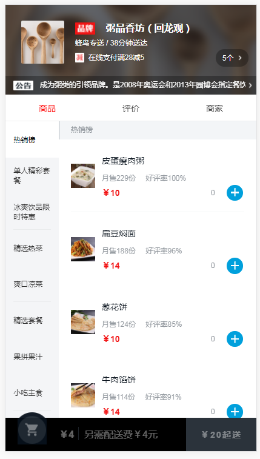
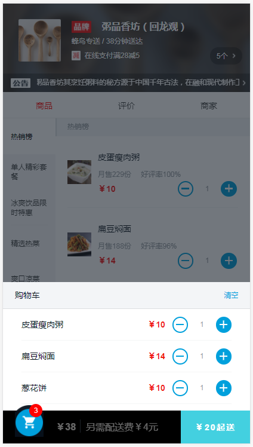
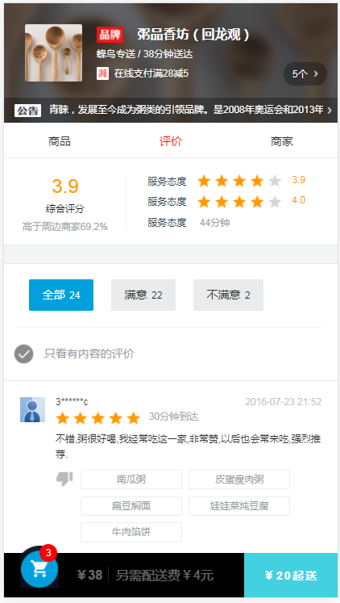
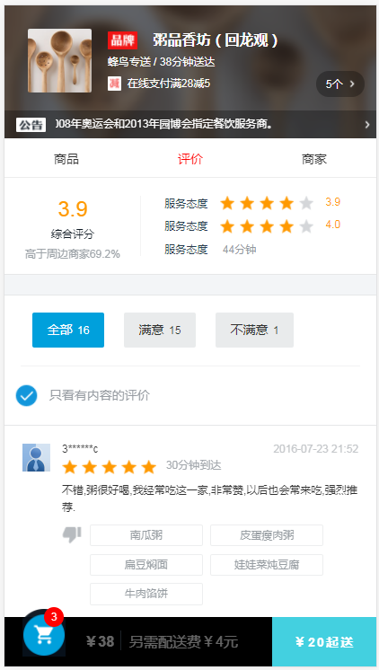

# 描述
    react的上手项目，用vue-cli脚手架改造成的react配置环境，模仿饿了吗移动端单个餐厅页面

# 技术栈
react + redux + react-router + webpack + es6 + axios + flex布局 + sass

# 演示
[查看演示效果](https://erpang123.github.io/react-redux/dist-html)（请用chrome的手机模式预览）

## 项目运行

``` bash
# install dependencies
npm install

# serve with hot reload at localhost:8080
npm run dev

# build for production with minification
npm run build

# build for production and view the bundle analyzer report
npm run build --report
```

For detailed explanation on how things work, checkout the [guide](http://vuejs-templates.github.io/webpack/) and [docs for vue-loader](http://vuejs.github.io/vue-loader).

# 部分截图
## 商品列表

## 商品详情

## 购物车列表

## 评价



# 项目布局
```
.
├── build                                       // webpack配置文件
├── config                                      // 项目打包路径
├── data                                        // 打包后各文件的所占比重图
├── dist                                        // 上线项目文件，放在服务器即可正常访问
├── mock                                        // 模拟数据
├── screenshots                                 // 项目截图
├── src                                         // 源码目录
│   ├── components                              // 组件目录
│   ├── assets                                  // 公共图片
│   ├── bundle                                  // 异步组件加载
│   ├── action                                  // view与store交互的载体
│   ├── dispatch                                // 设置view与store的交互方式
│   ├── reducer                                 // view获取store中值得方式
│   ├── store                                   // 创建store
│   └── sass
│       └── main.css                            // 样式文件
│   ├── main.js                                 // 程序入口文件，加载各种公共组件
├── index.html                                  // 入口html文件
.
```